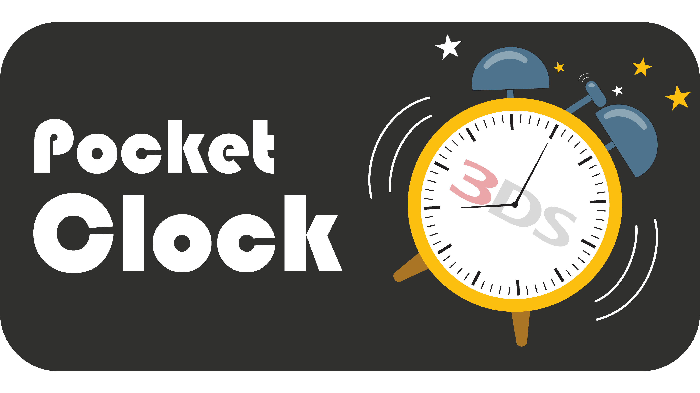

# PocketClock - A powerful Clock App for Nintendo 3DS

<p align="center">
  
</p>

**PocketClock** is a native, dual-screen clock application inspired by modern smartphone built-in clock apps, engineered specifically for the Nintendo 3DS homebrew ecosystem. Featuring an alarm clock, world clock, stopwatch, and countdown timer with a familiar, user-friendly interface and advanced power management. 

## Screenshots

<details>
<summary>Click to view screenshots</summary>

### Alarm

  

### World Clock

  

### Stopwatch

  

### Timer

  

### Settings

  

 

### Manual and About

  

<em> All screenshots were taken on Azahar Emulator, The quality is much better on real hardware.</em>

</details>

## Features

### 1. Alarm
* **Multiple Alarms:** Configure up to **32 independent alarms** with automatic chronological sorting by time-of-day.
* **Custom Labels:** Assign custom labels (up to 20 bytes UTF-8) using Nintendo 3DS's native touch keyboard. Labels appear on alarm cards, top screen telemetry, and active ringing screens.
* **9-Minute Snooze Modal:**
  * Clean, dual-button centered modal: an oversized **Snooze** button positioned directly above a **Dismiss** button.
  * Reliable Scheduling: Snooze countdown is tied to actual elapsed hardware time, preventing time adjustments in Settings from breaking snooze countdowns.
* **Audio Engine & Built-in Ringtones:**
  * 3 built-in ringtones (`Default Alarm`, `Digital Clock`, `Christmas`) streamed via hardware audio with minimal CPU usage.
  * Tap the ringtone in the editor to preview the track for one loop. Tapping again, switching tracks, or saving immediately halts playback. 
* **Custom MP3 Support:** You can place your own `.mp3` files in `sdmc:/3ds/pocketclock/ringtones/`. PocketClock automatically indexes up to 16 user ringtones with low-overhead background streaming via `3ds-mpg123`.

### 2. World Clock 
* **Expanded City List:** Track up to **32 world cities** simultaneously with real-time Day/Night status indicator badges.
* **Embedded Time Zone Database:** Includes 84 major international cities covering every standard and fractional UTC offset from UTC-12 to UTC+14 without requiring internet access.
* **DST Algorithms:** Automatically calculates Daylight Saving Time for supported regions without an internet connection:
  * **USA / North America:** Second Sunday in March to first Sunday in November.
  * **European Union:** Last Sunday in March to last Sunday in October.
  * **Australia (Southern Hemisphere):** First Sunday in October to first Sunday in April.
  * **New Zealand (Southern Hemisphere):** Last Sunday in September to first Sunday in April.
* **Home City Differential Reference:** Dynamically computes and displays the relative hour offset (`+X hrs`, `-X hrs`) against your designated Home City.

### 3. Stopwatch
* **Centisecond Accuracy:** High-precision hardware timer running at $1/100\text{s}$ resolution.
* **Adaptive Formatting:** Automatically expands from `MM:SS.cs` to `H:MM:SS.cs` as hours accumulate.
* **200-Lap Split Memory:** Record up to 200 lap splits with a scrollable list and split time delta calculations.

### 4. Timer
* **Intuitive H:M:S Steppers:** Quick-increment/decrement arrow steppers for hours, minutes, and seconds.
* **Dedicated Chime Audio Loop:** Rings on completion with a 5-minute auto-silence timeout.
* **Conflict Resolution:** Unconditional Alarm > Timer priority ensures scheduled morning alarms preempt and silence any running timer overlay immediately.

### 5. Display and Power
* **Multiple Display Modes:** Standard dual-screen mode, top-screen only (bottom screen turned off), or full Night Standby where both screens are completely turned off to reserve battery and keep the console cool overnight.
* **Instant Night Standby Hotkey:** Press <kbd>L + R</kbd> anywhere to power down both screens instantly.
* **Configurable Auto-Display-Off Inactivity:** Adjustable inactivity timeout (`Never`, `1 min`, `3 min`, `5 min`, `10 min`, `20 min`, `30 min`, `60 min`).
* **Wake Preemption Safeguard:** LCD backlights automatically power back on the instant an alarm or timer fires. Screens never turn off while ringing.
* **Audio Jack Support:** If headphones or an external speaker are plugged in, you can close the 3DS lid without the app going to sleep, allowing alarms to ring while closed. If unplugged, the console enters standard sleep to protect battery life.

## Controls

PocketClock features dual-input: Every action can be performed via touchscreen and some actions with physical buttons.

| Action / Context | Physical Buttons | Touchscreen Control |
|:---|:---|:---|
| **Global Navigation** | <kbd>L</kbd> / <kbd>R</kbd> | Tap docked bottom tab bar icons |
| **Night Standby (Screens Off)** | <kbd>L + R</kbd> (Simultaneous) | Configurable via Display Settings |
| **Wake Screens from Standby** | Any D-Pad / Face Button | Tap touchscreen |
| **Open Settings** | <kbd>SELECT</kbd> | Tap gear icon in top-left header |
| **Save & Exit** | <kbd>START</kbd> | -- |
| **Alarm List: Scroll** | <kbd>D-Pad Up / Down</kbd> or <kbd>Circle Pad</kbd> | Touch & drag card list |
| **Alarm List: Edit** | <kbd>A</kbd> | Tap alarm card body |
| **Alarm List: Quick Toggle** | <kbd>Y</kbd> | Tap square enable checkbox |
| **Alarm List: Delete** | <kbd>X</kbd> (with modal confirmation) | Tap `[🗑]` trash button |
| **Alarm List: Add New** | -- | Tap `[+]` button in header |
| **Ringing Alarm: Snooze** | <kbd>A</kbd> | Tap `[SNOOZE]` button |
| **Ringing Alarm: Dismiss** | <kbd>B</kbd> | Tap `[DISMISS]` button |
| **World Clock: Set Home City** | <kbd>A</kbd> | Tap city card |
| **World Clock: Add City** | <kbd>Y</kbd> | Tap `[+]` button in header |
| **World Clock: Remove City** | <kbd>X</kbd> | Tap `[🗑]` trash button |
| **Stopwatch: Start / Pause** | <kbd>A</kbd> | Tap `Start` / `Pause` / `Resume` button |
| **Stopwatch: Reset** | <kbd>B</kbd> | Tap `Reset` button |
| **Stopwatch: Record Lap** | <kbd>Y</kbd> | Tap `Lap` button |
| **Timer: Start / Pause** | <kbd>A</kbd> | Tap `Start` / `Pause` / `Resume` button |
| **Timer: Reset** | <kbd>B</kbd> | Tap `Reset` button |
| **Timer Ringing: Dismiss** | <kbd>A</kbd> or <kbd>B</kbd> | Tap `[Dismiss]` button |
| **In-App Manual: Page Flip** | <kbd>L</kbd> / <kbd>R</kbd> | Tap `◄` / `►` stepper buttons |
| **In-App Manual: Scroll** | <kbd>D-Pad</kbd> / <kbd>Circle Pad</kbd> | Touch & drag content area |

## Installation

Download the latest version of PocketClock from [Releases](https://github.com/piracyiskey/3DS-Alarm-Clock/releases). 

### Method 1: Installable CIA (`PocketClock.cia`) - Recommended
1. Copy `PocketClock.cia` to your SD card.
2. Open **FBI** on your Nintendo 3DS.
3. Navigate to `SD` $\to$ locate `PocketClock.cia` $\to$ select **Install and delete CIA**.
4. Press <kbd>HOME</kbd> to unwrap PocketClock on your 3DS HOME Menu.

### Method 2: Homebrew Launcher (`PocketClock.3dsx`)
1. Copy `PocketClock.3dsx` to `sdmc:/3ds/PocketClock/` (or `sdmc:/3ds/`) on your SD card.
2. Launch **PocketClock** from the Homebrew Launcher.
3. *(Optional)* You can also stream and run it wirelessly over local Wi-Fi from your PC using `3dslink`:
   ```powershell
   3dslink PocketClock.3dsx -a <3DS_IP_ADDRESS> -s
   ```

## Recommended Overnight Setup

To guarantee that your Nintendo 3DS functions as a reliable alarm clock:

1. **Keep Connected to AC Charger:** Always plug the console into its wall charger so the battery will not deplete.
2. **Set Physical Volume Slider to Maximum:** Push the console's physical slider fully upward to ensure ringtones play at maximum volume.
3. **Leave Clamshell Lid Open:** Closing the 3DS clamshell triggers a physical magnetic switch that cuts the internal stereo speakers. Leave the lid open, or connect headphones/external AUX speakers if you prefer keeping the lid closed.
4. **Turn off the screens:** Press <kbd>L + R</kbd> before sleeping to shut off both LCD backlights. This keeps your bedroom dark and cools the system. Backlights will wake up automatically when the alarm rings.
5. **Set Auto turn off display:** Configure an inactivity timer (1 to 5 minutes) in Settings so screens turn off automatically when left unattended.
6. **Dim Front LEDs (Optional via Rosalina):** If the blue power LED or yellow Wi-Fi LED is too bright in the dark:
   * Press <kbd>L</kbd> + <kbd>D-Pad Down</kbd> + <kbd>SELECT</kbd> to open the Luma3DS Rosalina menu.
   * Navigate to `System Configuration` $\to$ `Toggle LEDs`.

## Limitations

* **No Background Execution Outside App:** The 3DS operating system suspends homebrew applications whenever the <kbd>HOME</kbd> button is pressed or another title is opened. PocketClock must remain open to trigger alarms.
* **Hardware Clamshell Speaker Cutoff:** On Nintendo 3DS clamshell models, closing the lid trips a physical magnetic sensor that mechanically disconnects power to the internal speakers. No software can bypass this physical hardware cut.
* **Audio System Architecture:**
  * **Hardware-Accelerated Audio:** PocketClock utilizes the 3DS dedicated audio hardware alongside `mpg123` for fast, low-overhead MP3 streaming from the SD card, rather than being restricted to basic beeps or uncompressed audio.
  * **Analog Volume Slider Reality:** The 3DS physical volume slider is an analog control wired directly to the speaker amplifier. Software cannot amplify past this physical limit. PocketClock guides users to set the volume slider to maximum and provides an audio preview in the editor to test volume levels. You can try override the volume via Rosalina Menu. 
  * **Safe Sleep & Battery Preservation:** Rather than forcing the console to stay awake when the lid is closed (which drains battery into muted internal speakers), PocketClock allows standard sleep when headphones are unplugged.
* **Console Clock Safety:** Adjusting the time or date inside PocketClock modifies internal display offsets only; it **never** alters the 3DS console's system clock. Games with time-penalty mechanics (*Animal Crossing*, *Pokémon*, etc.) remain completely unaffected. Therefore, you can use this app to keep track of the current time if you need to change the 3DS system clock for any reason.

## Building from Source

### 1. Environment Setup (Windows)
1. Install the [devkitPro Updater](https://devkitpro.org/wiki/Getting_Started) for Windows to the default location (`C:\devkitPro`).
2. Open the **MSYS2** terminal provided by devkitPro and install the necessary 3DS toolchain packages:
   ```bash
   pacman -S 3ds-dev 3ds-mpg123 tex3ds
   ```
3. Ensure tools like `bannertool` and `makerom` are properly installed in `C:\devkitPro\tools\bin`.

### 2. Cloning the Repository
Open a terminal (e.g., PowerShell or Git Bash) and clone the PocketClock repository:
```bash
git clone https://github.com/piracyiskey/3DS-Alarm-Clock.git
cd 3DS-Alarm-Clock
```

### 3. Compilation
You can build the project using the MSYS2 GNU Make executable included with devkitPro. Open PowerShell and run the following commands from the repository root:

* **Clean Build:** 
  ```powershell
  Remove-Item -Recurse -Force build; & "C:\devkitPro\msys2\usr\bin\make.exe"
  ```
* **Fast Build:**
  ```powershell
  make
  ```

### 4. Build Outputs
Upon a successful build, the following artifacts are generated:
* `PocketClock.3dsx` - Homebrew Launcher executable. 
* `PocketClock.cia` - Installable title.
* `PocketClock.elf` - Executable and Linkable Format binary.
* `PocketClock.smdh` - Title metadata and icon container.

## Credits

**Development & Assets:**
- [Nguyen Manh Dung](https://github.com/piracyiskey) - Lead developer, designer
- [Icons8](https://icons8.com/) - Visual icon assets
- [Pixabay](https://pixabay.com/) - Royalty-free alarm ringtones and sound effects
- Banner and app icon are hand drawn by me using [Adobe Illustrator](https://www.adobe.com/products/illustrator.html).

**Libraries & Tools:**
- [libctru](https://github.com/devkitPro/libctru) - Core Nintendo 3DS homebrew OS and services library
- [Citro2D](https://github.com/devkitPro/citro2d) - 2D graphics rendering library
- [Citro3D](https://github.com/devkitPro/citro3d) - Hardware 3D graphics rendering library
- [mpg123](https://www.mpg123.de/) - Fast MPEG audio decoding engine (`3ds-mpg123`)
- [devkitPro](https://devkitpro.org/) - devkitARM cross-compiler and build environment
- [tex3ds](https://github.com/devkitPro/tex3ds) - Texture conversion and sprite sheet packaging tool
- [bannertool](https://github.com/Epicpkmn11/bannertool) - 3DS banner creation tool
- [makerom](https://github.com/profi200/Project_CTR) - CTR application packaging tool

**Special Thanks:**
- [Luma3DS](https://github.com/LumaTeam/Luma3DS) - Custom firmware, Rosalina menu, and debugging support
- [3DBrew](https://www.3dbrew.org/) - 3DS hardware, services, and software documentation
- [Nintendo Homebrew Community](https://discord.gg/nintendohomebrew) - Continuous support, testing, and documentation
